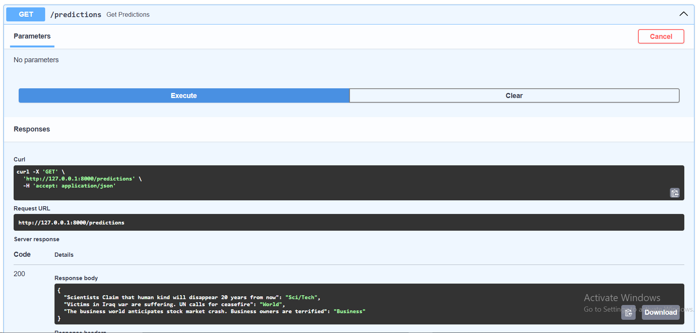

# News Articles Classification API

This project involves training and deploying three sequential  deep learning models to classify news headlines into predefined categories such as *World*, *Business*, *Sci/Tech*, *Sports*. The models are deployed using **FastAPI** with endpoints for predictions..

---

## Models Trained

The models were trained using glove embeddings and regular embedding layers with cross-validation and Grid Search. Evaluation was done using **accuracy** and **F1-score** metrics.

| Model | Accuracy Range | Notes |
|-------|----------------|-------|
| RNN + GloVe | 89–91% | Lightweight sequential model |
| LSTM | 90–91% | Captures long-term dependencies |
| GRU | 90–91% | Similar to LSTM but with fewer parameters |

---

## Fast API Endpoints


| Method | Endpoint         | Description                 |
|--------|------------------|-----------------------------|
| `GET`  | `/`              | Root message                |
| `POST` | `/predict_lstm`  | Get prediction using LSTM   |
| `POST` | `/predict_gru`   | Get prediction using GRU    |
| `GET`  | `/predictions`   | View all stored predictions |

---

### FastAPI Swagger UI Overview


### Example `/predictions` Endpoint Response



---

## How to Run the API

1. Open your terminal and run the following command:

    ```bash
    uvicorn main:app --reload
    ```

2. Once the server is running, open the Swagger UI in your browser:

    [http://127.0.0.1:8000/docs#/](http://127.0.0.1:8000/docs#/)
